# 📊  Marketing-Campaign-Performance-Analytics
A company runs multiple digital marketing campaigns across various channels but lacks visibility into campaign effectiveness.  As a result, marketing budgets may be allocated inefficiently, leading to reduced ROI and missed growth opportunities.

## 📑 Table of Contents

- [Project Overview](#project-overview)
- [Problem Statement](#problem-statement)
- [Project Objectives](#project-objectives)
- [Technologies Used](#technologies-used)
- [Project Structure](#-project-structure)
- [Database Schema](#-database-schema)
- [Power BI Dashboard](#-power-bi-dashboard)
- [Dashboards Preview](#-dashboards-preview)
- [Key Performance Indicators](#-key-performance-indicators)
- [Business Analysis Queries](#-business-analysis-queries)
- [Key Insights](#-key-insights)
- [Future Enhancements](#-future-enhancements)
- [Author](#author)

## Project Overview
This project analyzes digital marketing campaign performance using **MySQL** and **Power BI**. It helps businesses evaluate campaign effectiveness, customer engagement, conversions, revenue generation, and marketing ROI.

The project demonstrates end-to-end data analytics, including SQL querying, KPI analysis, dashboard development, and business insights.


## Problem Statement
Marketing teams invest significant budgets across multiple channels such as Email Marketing, Social Media, Search Ads, Display Ads, and Affiliate Marketing.

However, identifying which campaigns generate the highest revenue and ROI can be challenging.

This project provides a data-driven solution for analyzing campaign performance and optimizing marketing investments.


## Project Objectives
- Measure campaign performance
- Analyze customer conversions
- Calculate marketing KPIs
- Compare marketing channels
- Evaluate campaign ROI
- Analyze customer segments
- Generate actionable business insights


## Technologies Used
- MySQL
- SQL
- Power BI
- Microsoft Excel

## 📂 Project Structure
```text
Marketing-Campaign-Performance-Analytics
│
├── Campaign_performance_dashboards
├── Campaign_performance_sql_results
├── Dataset
├── PowerBI
├── Project_Report
├── Required_images
├── SQL
├── README.md
└── LICENSE
```

## 🗂 Database Schema
The project contains four main tables.

### Campaigns

Stores campaign details.

| Column |
|---------|
| Campaign_ID |
| Campaign_Name |
| Channel |
| Start_Date |
| End_Date |
| Budget |


### Campaign_Performance
Stores campaign performance metrics.

| Column |
|---------|
| Performance_ID |
| Campaign_ID |
| Date |
| Impressions |
| Clicks |
| Conversions |
| Revenue |
| Spend |


### Customers

Stores customer demographic information.

| Column |
|---------|
| Customer_ID |
| Customer_Name |
| Age |
| Gender |
| Location |
| Segment |


### Customer_Conversions

Stores customer conversion details.

| Column |
|---------|
| Conversion_ID |
| Customer_ID |
| Campaign_ID |
| Conversion_Date |
| Revenue |


## 📊 Power BI Dashboard
The dashboard consists of four pages.

## Executive Overview

Features:

- KPI Cards
- Revenue Trend
- Revenue vs Spend
- Revenue by Channel
- Interactive Filters


## Campaign Analysis

Features:

- Top Campaigns by Revenue
- Campaign ROI
- Campaign Conversion Rate
- Revenue vs Spend by Campaign
- Campaign Performance Table


## Channel Performance

Features:

- Revenue by Channel
- Spend by Channel
- ROI by Channel
- Conversion Rate by Channel
- Channel Comparison


## Customer Analysis

Features:

- Revenue by Customer Segment
- Revenue by Gender
- Revenue by Location
- Customer Distribution
- Age Distribution


## SQL Concepts Used
- SELECT
- WHERE
- GROUP BY
- HAVING
- ORDER BY
- INNER JOIN
- LEFT JOIN
- Aggregate Functions
- CASE Statements
- Views
- Common Table Expressions (CTEs)
- Window Functions
- Ranking Functions


## 📈 Power BI Features
- KPI Cards
- Bar Charts
- Column Charts
- Line Charts
- Donut Charts
- Tables
- Slicers
- Interactive Dashboard

## 📊 Dashboards Preview
<p>
  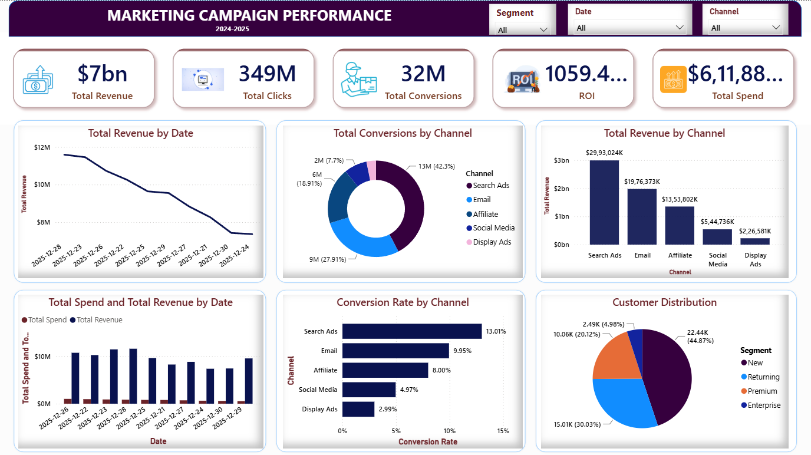
</p>

<p>
  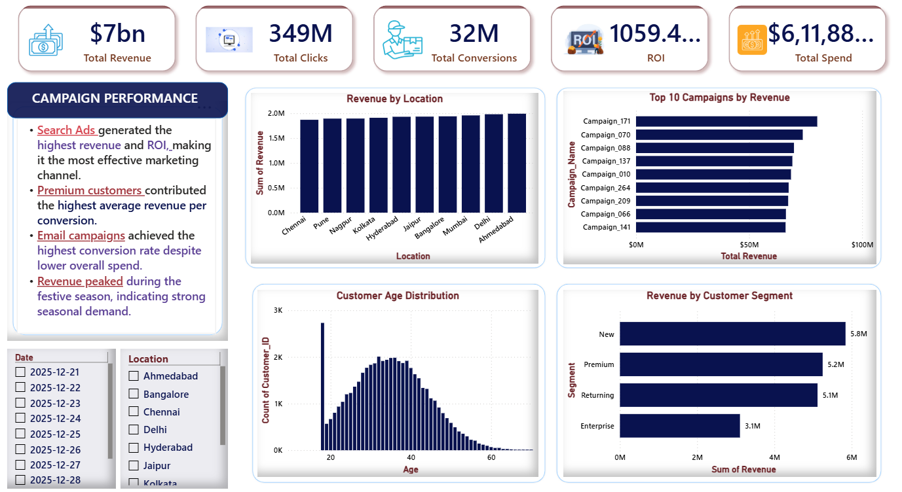
</p>

## 📈 Key Performance Indicators
- Total Revenue
- Total Clicks
- Total Spend
- Total Impressions
- Total Conversions
- Click Through Rate (CTR)
- Conversion Rate
- Return on Investment (ROI)
- Return on Ad Spend (ROAS)
- Customer Acquisition Cost (CAC)

## KPI 1: Total Revenue Generated
### Business Question
What is the total revenue generated from all marketing campaigns?

### SQL Query

```sql
SELECT
ROUND(SUM(Revenue),2) AS Revenue
FROM Campaign_Performance;
```

### Output

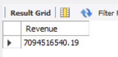

## KPI 2: Total Clicks

### Business Question

How many total clicks were generated across all marketing campaigns?

### SQL Query

```sql
SELECT
SUM(Clicks) Total_Clicks
FROM Campaign_Performance;
```

### Output

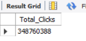

## KPI 3: Total Marketing Spend

### Business Question

How much money was spent across all marketing campaigns?

### SQL Query

```sql
SELECT
ROUND(SUM(Spend),2) AS Total_Spend
FROM Campaign_Performance;
```

### Output

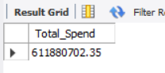

### Business Insight

- This KPI represents the total investment made across all marketing campaigns.
- It serves as the baseline for evaluating marketing efficiency.
- Total Spend is used to calculate important metrics such as ROI, ROAS, and Customer Acquisition Cost (CAC).

## KPI 4: Total Impressions

### Business Question

How many total impressions were generated by all marketing campaigns?

### SQL Query

```sql
SELECT
SUM(Impressions) Total_Impressions
FROM Campaign_Performance;
```

### Output

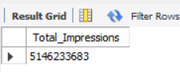

### Business Insight

- Total Impressions indicate how many times advertisements were displayed to users.
- This metric helps measure campaign reach and brand visibility.
- It is also used to calculate the Click-Through Rate (CTR).

## KPI 5: Total Conversions

### Business Question

How many successful conversions were generated from all marketing campaigns?

### SQL Query

```sql
SELECT
SUM(Conversions) Total_Conversions
FROM Campaign_Performance;
```

### Output

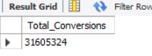

### Business Insight

- Total Conversions represent the number of successful customer actions resulting from marketing campaigns.
- This KPI is one of the most important indicators of campaign success.
- Higher conversions generally reflect more effective marketing strategies.

## KPI 6: Click Through Rate (CTR)

### Business Question

What is the overall Click Through Rate (CTR) across all marketing campaigns?

### SQL Query

```sql
SELECT
ROUND(
SUM(Clicks)*100/
SUM(Impressions),2
) CTR;
```
### Output
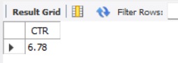

### Business Insight

- CTR measures the percentage of users who clicked on an advertisement after viewing it.
- A higher CTR indicates that campaigns are attracting audience attention effectively.
- CTR is a key metric for evaluating advertisement engagement.

## KPI 7: Conversion Rate

### Business Question

What is the overall conversion rate across all marketing campaigns?

### SQL Query

```sql
SELECT
ROUND(
SUM(Conversions)*100/
SUM(Clicks),2
) Conversion_Rate
FROM Campaign_Performance;
```

### Output

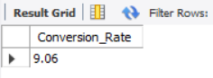

### Business Insight

- Conversion Rate measures the percentage of users who completed the desired action after clicking on an advertisement.
- A higher conversion rate indicates that marketing campaigns are effectively converting visitors into customers.
- This KPI helps evaluate campaign quality and landing page effectiveness.

## KPI 8: Return on Investment (ROI)

### Business Question

What is the overall Return on Investment (ROI) of all marketing campaigns?

### SQL Query

```sql
SELECT
ROUND(
((SUM(Revenue)-SUM(Spend))
/
SUM(Spend))*100,2
) ROI
FROM Campaign_Performance;
```

### Output

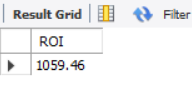

### Business Insight

- ROI measures the profitability of marketing campaigns.
- A positive ROI indicates that campaigns generated more revenue than the amount invested.
- This KPI helps businesses identify whether marketing budgets are being utilized efficiently.

## KPI 9: Return on Ad Spend (ROAS)

### Business Question

What is the overall Return on Ad Spend (ROAS)?

### SQL Query

```sql
SELECT
ROUND(
SUM(Revenue)/SUM(Spend),2
) ROAS
FROM Campaign_Performance;
```

### Output

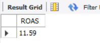

### Business Insight

- ROAS measures the revenue earned for every dollar spent on advertising.
- A higher ROAS indicates more effective marketing campaigns.
- This metric is widely used to compare the performance of different marketing channels.

## KPI 10: Customer Acquisition Cost (CAC)

### Business Question

What is the average Customer Acquisition Cost (CAC)?

### SQL Query

```sql
SELECT
ROUND(
SUM(Spend)/SUM(Conversions),2
) CAC
FROM Campaign_Performance;
```

### Output

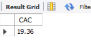
### Business Insight

- Customer Acquisition Cost represents the average marketing cost required to acquire one customer.
- Lower CAC indicates more efficient customer acquisition.
- Monitoring CAC helps businesses optimize marketing budgets while maintaining customer growth.

# 📊 Business Analysis Queries

## Business Question 1: Which Marketing Channel Generated the Highest Revenue?

### SQL Query

```sql
SELECT
c.Channel,
SUM(cp.Revenue) Revenue
FROM Campaigns c
JOIN Campaign_Performance cp
ON c.Campaign_ID=cp.Campaign_ID
GROUP BY c.Channel
ORDER BY Revenue DESC;
```

### Output

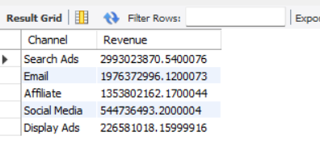

### Business Insight

- This analysis compares revenue generated across different marketing channels.
- It helps identify the highest-performing marketing channel.
- High-performing channels can be prioritized for future marketing investments.

## Business Question 2: Which Marketing Channel Had the Highest Marketing Spend?

### SQL Query

```sql
SELECT
    c.Channel,
    ROUND(SUM(cp.Spend),2) AS Total_Spend
FROM Campaigns c
JOIN Campaign_Performance cp
ON c.Campaign_ID = cp.Campaign_ID
GROUP BY c.Channel
ORDER BY Total_Spend DESC;
```

### Output

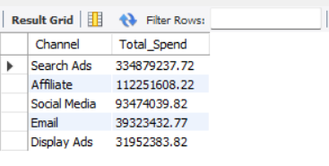


### Business Insight

- This query shows how the marketing budget was distributed across channels.
- Comparing spend with revenue helps evaluate campaign efficiency.
- Channels with high spend but lower returns may require optimization.

## Business Question 3: Which Marketing Channel Achieved the Highest ROI?

### SQL Query

```sql
SELECT
c.Channel,

ROUND(
((SUM(cp.Revenue)-SUM(cp.Spend))
/
SUM(cp.Spend))*100,2
) ROI

FROM Campaigns c
JOIN Campaign_Performance cp
ON c.Campaign_ID=cp.Campaign_ID

GROUP BY c.Channel
ORDER BY ROI DESC;
```

### Output

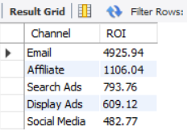

### Business Insight

- ROI measures the profitability of each marketing channel.
- A higher ROI indicates better financial performance.
- This analysis helps allocate marketing budgets more effectively.

## Business Question 4: Which Marketing Channel Has the Highest Conversion Rate?

### SQL Query

```sql
SELECT
c.Channel,

ROUND(
SUM(cp.Conversions)*100/
SUM(cp.Clicks),2
) Conversion_Rate

FROM Campaigns c
JOIN Campaign_Performance cp
ON c.Campaign_ID=cp.Campaign_ID

GROUP BY c.Channel;
```

### Output

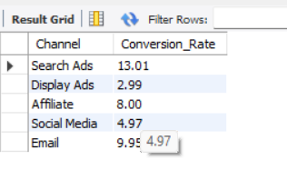

### Business Insight

- Conversion Rate indicates how effectively each marketing channel converts visitors into customers.
- Higher conversion rates suggest better campaign quality and audience targeting.
- Marketing teams can use this insight to improve campaign strategies.

## 📌 Business Question 5: Which Marketing Channels Generated the Highest Number of Conversions?

### SQL Query

```sql
SELECT
    c.Channel,
    SUM(cp.Conversions) AS Total_Conversions
FROM Campaigns c
JOIN Campaign_Performance cp
ON c.Campaign_ID = cp.Campaign_ID
GROUP BY c.Channel
ORDER BY Total_Conversions DESC;
```

### Output


### Business Insight

- This analysis identifies which marketing channels contributed the most customer conversions.
- It helps measure the effectiveness of each channel in driving successful customer actions.
- High-converting channels should be considered for increased marketing investment.

## Business Question 6: Which Campaigns Generated the Highest Revenue?

### SQL Query

```sql
SELECT
c.Campaign_Name,
SUM(cp.Revenue) Revenue
FROM Campaigns c
JOIN Campaign_Performance cp
ON c.Campaign_ID=cp.Campaign_ID
GROUP BY c.Campaign_Name
ORDER BY Revenue DESC
LIMIT 10;
```

### Output

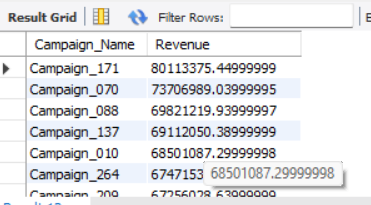

### Business Insight

- This analysis identifies the top 10 revenue-generating marketing campaigns.
- These campaigns contributed the most to overall business revenue.
- The company should analyze the strategies used in these campaigns and replicate them in future marketing initiatives.

## Business Question 7: Which Campaigns Achieved the Highest ROI?

### SQL Query

```sql
SELECT
c.Campaign_Name,

ROUND(
((SUM(cp.Revenue)-SUM(cp.Spend))
/
SUM(cp.Spend))*100,2
) ROI


FROM Campaigns c
JOIN Campaign_Performance cp
ON c.Campaign_ID=cp.Campaign_ID

GROUP BY c.Campaign_Name
ORDER BY ROI DESC;
```

### Output

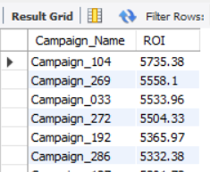

### Business Insight

- ROI measures campaign profitability.
- Campaigns with the highest ROI generated the greatest profit relative to their marketing investment.
- These campaigns represent the most cost-effective marketing strategies.

## Business Question 8: Which Campaigns Have the Highest Conversions?

### SQL Query

```sql
SELECT
c.Campaign_Name,
SUM(cp.Conversions) Conversions
FROM Campaigns c
JOIN Campaign_Performance cp
ON c.Campaign_ID=cp.Campaign_ID
GROUP BY c.Campaign_Name
ORDER BY Conversions DESC;
```

### Output

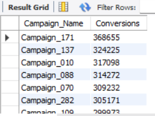

### Business Insight

- Conversion Rate measures how efficiently campaigns convert clicks into successful customer actions.
- Campaigns with higher conversion rates demonstrate stronger audience targeting and more effective marketing strategies.

## 📌 Business Question 9: Which Campaigns Received the Highest Marketing Spend?

### SQL Query

```sql
SELECT
    c.Campaign_Name,
    ROUND(SUM(cp.Spend),2) AS Total_Spend
FROM Campaigns c
JOIN Campaign_Performance cp
ON c.Campaign_ID = cp.Campaign_ID
GROUP BY c.Campaign_Name
ORDER BY Total_Spend DESC
LIMIT 10;
```

### Output
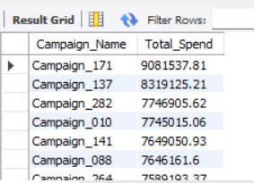


### Business Insight

- This analysis identifies campaigns with the highest marketing investment.
- Comparing marketing spend with revenue and ROI helps determine whether the investment generated sufficient returns.
- High-spend campaigns with low ROI may require optimization.

## Business Question 10: Which Campaigns Generated the Highest Number of Conversions?

### SQL Query

```sql
SELECT
    c.Campaign_Name,
    SUM(cp.Conversions) AS Total_Conversions
FROM Campaigns c
JOIN Campaign_Performance cp
ON c.Campaign_ID = cp.Campaign_ID
GROUP BY c.Campaign_Name
ORDER BY Total_Conversions DESC
LIMIT 10;
```

### Output
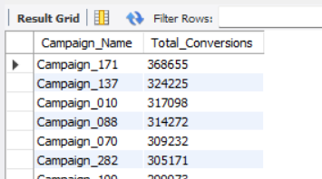


### Business Insight

- This query identifies the campaigns that generated the highest number of customer conversions.
- High-converting campaigns indicate effective messaging and audience engagement.
- These campaigns can serve as benchmarks for future marketing initiatives.

## Business Question 11: How Do Monthly Conversions Vary Over Time?

### SQL Query

```sql
SELECT

DATE_FORMAT(Date,'%Y-%m') Month,

SUM(Conversions) Conversions

FROM Campaign_Performance

GROUP BY Month

ORDER BY Month;
```

### Output


### Business Insight

- This analysis tracks the total number of customer conversions on a monthly basis.
- It helps identify seasonal trends, peak-performing months, and periods with lower customer engagement.
- Marketing teams can use these insights to optimize campaign timing, allocate budgets effectively, and improve future campaign planning.


## Business Question 12: How Does Monthly Marketing Spend Change Over Time?

### SQL Query

```sql
SELECT

DATE_FORMAT(Date,'%Y-%m') Month,

SUM(Spend) Spend

FROM Campaign_Performance

GROUP BY Month

ORDER BY Month;
```

### Output
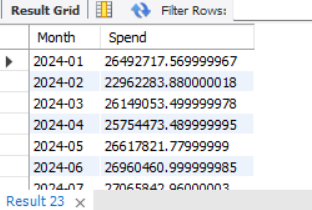

### Business Insight

- This analysis shows the monthly distribution of marketing expenditure across all campaigns.
- It helps identify periods of increased or reduced marketing investment.
- Comparing monthly spending with revenue and conversions enables businesses to evaluate whether higher marketing investments resulted in improved campaign performance.


## 📈 Key Insights
- Search Ads generated the highest revenue.
- Email campaigns achieved the highest conversion rate.
- Premium customer segments contributed the highest revenue.
- Higher campaign spend did not always result in higher ROI.
- Marketing performance varied significantly across channels.


## 🚀 Future Enhancements
- Predict campaign success using Machine Learning
- Real-time dashboard integration
- Customer Lifetime Value (CLV) analysis
- Marketing Forecasting
- Automated Reporting


## Author
**Prajakta Bhondave**
- Aspiring Data Analyst | SQL |Power BI |Python |Excel |Data Visualization
